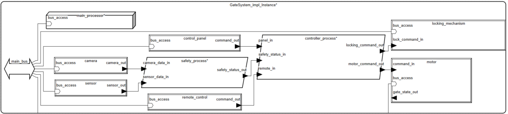
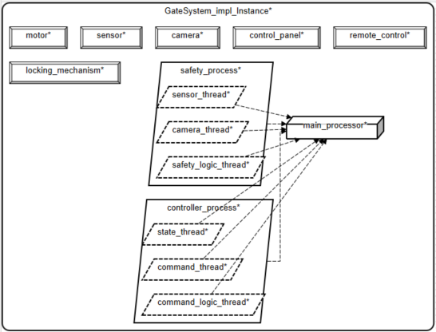

# Projekt zaliczeniowy
**Tytuł modelu:** Zdalne sterowanie systemem bramy wjazdowej \
**Dane studenta:** Tomasz Janeczko, tomekj@student.agh.edu.pl \
**Kurs:** Systemy Czasu Rzeczywistego, semestr letni 2024/25 gr.2

# 1. Opis Modelowanego Systemu
Przedmiotem modelowania jest automatyczny kontroler bramy wjazdowej. Jego głównym zadaniem jest bezpieczne zarządzanie ruchem bramy, polegające na odbieraniu komend od użytkownika i jednoczesnym reagowaniu na dane z czujników, by unikać kolizji z przeszkodami. Całość została zaprojektowana w języku AADL, umożliwia przeprowadzenie szczegółowych analiz wydajności i harmonogramowania.\
Główne elementy systemu to:
### Sprzęt
*   Mózgiem operacji jest procesor (`MainProcessor`) połączony z magistralą (`HWBus`), która służy do wymiany danych między wszystkimi podzespołami.

### Urządzenia wejścia
*   Użytkownik ma do dyspozycji pilota (`RemoteControl`) oraz panel sterowania (`ControlPanel`) do wysyłania komend.
*   Za bezpieczeństwo odpowiadają czujnik (`Sensor`) oraz kamera (`Camera`), które na bieżąco monitorują przestrzeń wokół bramy.

### Urządzenia wyjścia
*   Bezpośrednio na bramę działają silnik (`Motor`), który nią porusza, oraz mechanizm blokujący (`LockingMechanism`), zabezpieczający ją w pozycji zamkniętej.

### Oprogramowanie
*   Oprogramowanie składa się z dwóch kluczowych procesów:
    *   **`GateControllerProcess`**: Przetwarza komendy i dane z bezpieczeństwa, wysyłając sygnały do silnika i zamka.
    *   **`SafetyProcess`**: Zbiera dane z czujników i kamery, by przekazać skonsolidowaną informację o statusie bezpieczeństwa do kontrolera.

Cała architektura została zaprojektowana modułowo, co ułatwia testowanie i analizy. Wszystkie procesy oprogramowania działają na jednym procesorze, co pozwoliło na przeprowadzenie szczegółowych analiz wydajności i harmonogramowania.

# 2. Opis ogólny

Model systemu sterowania bramą został zbudowany w języku AADL, aby precyzyjnie zdefiniować i przeanalizować jego architekturę. Zastosowano w nim podejście oparte na komponentach, co pozwoliło na podział złożonego systemu na mniejsze, łatwe do zarządzania jednostki: sprzęt (procesor, magistrala), urządzenia wejścia/wyjścia (piloty, silnik) oraz oprogramowanie (procesy sterujące).

Ważnym elementem modelu jest jasne rozdzielenie na platformę sprzętową i oprogramowanie. Umożliwiło to zdefiniowanie procesów sterowania i wątków, a następnie przypisanie ich do konkretnego procesora. Takie podejście jest podstawą do przeprowadzenia kluczowych analiz wydajności, takich jak sprawdzenie budżetu mocy obliczeniowej (MIPS) oraz harmonogramowania zadań.

W modelu zastosowano hierarchiczną strukturę. Główny system (`GateSystem`) zawiera podkomponenty, takie jak procesy i urządzenia, które z kolei składają się z wątków. W ten sposób uzyskano przejrzystą i skalowalną architekturę. Oprogramowanie komunikuje się ze sprzętem za pomocą portów i połączeń, co odzwierciedla rzeczywisty przepływ danych i sygnałów w systemie wbudowanym.

Całość projektu skupia się na niezawodności i bezpieczeństwie, co znajduje odzwierciedlenie w wydzielonym procesie (`SafetyProcess`), odpowiedzialnym za monitorowanie otoczenia bramy. Takie rozdzielenie ról gwarantuje, że kluczowe funkcje bezpieczeństwa są niezależne od standardowego sterowania.

# 3. Opis dla użytkownika

System sterowania bramą wjazdową został zaprojektowany z myślą o zapewnieniu intuicyjnej i bezpiecznej obsługi.

Z perspektywy użytkownika, brama może być obsługiwana na dwa sposoby:
*   **Zdalnie:** Za pomocą pilota, który wysyła sygnały do otwarcia, zamknięcia lub zatrzymania bramy.
*   **Lokalnie:** Przez panel sterowania umieszczony w pobliżu bramy, który oferuje te same funkcje.

Gdy użytkownik wyda polecenie, na przykład otwarcia bramy, system uruchomi silnik, a brama zacznie się przesuwać. W tym samym czasie system bezpieczeństwa będzie stale monitorował otoczenie. Jeśli w trakcie ruchu kamery lub czujniki wykryją przeszkodę (np. samochód, osobę lub zwierzę), system natychmiastowo zatrzyma bramę, aby uniknąć kolizji.

Działanie systemu jest w pełni automatyczne. Został on zaprojektowany tak, aby reagować na zagrożenia w czasie rzeczywistym, co zapewnia wysoki poziom bezpieczeństwa i niezawodności.

# 4. Spis komponentów AADL z komentarzem

W tej sekcji przedstawiono listę wszystkich komponentów użytych w modelu, wraz z ich krótkim opisem i rolą w systemie. Każdy komponent, zdefiniowany w języku AADL, stanowi kluczowy element architektury.

### Komponenty oprogramowania (processes)
*   **`GateControllerProcess`**: Centralny proces zarządzania bramą. Odbiera komendy od użytkownika (z pilota i panelu sterowania) oraz dane o bezpieczeństwie z procesu `SafetyProcess`. Na ich podstawie podejmuje decyzje o ruchu bramy, wysyłając sygnały do silnika i mechanizmu blokującego.
*   **`SafetyProcess`**: Odpowiedzialny za monitorowanie otoczenia bramy. Gromadzi dane z czujnika i kamery, analizuje je i określa, czy w pobliżu znajduje się przeszkoda. Następnie przekazuje status bezpieczeństwa do procesu `GateControllerProcess`, co pozwala na natychmiastowe zatrzymanie bramy w razie zagrożenia.

### Komponenty oprogramowania (threads)
*   **`CommandLogicThread`**: Wątek pośredniczący, który łączy sygnały z pilota i panelu sterowania, tworząc jedno spójne polecenie dla głównego wątku sterującego. Zapewnia to, że system nie otrzymuje sprzecznych komend z wielu źródeł.
*   **`CommandThread`**: Wątek decyzyjny. Odbiera skonsolidowane komendy od użytkownika oraz status bezpieczeństwa, a następnie podejmuje decyzję o wysłaniu polecenia do silnika.
*   **`GateStateThread`**: Odpowiada za zarządzanie stanem bramy (np. `Closed`, `Open`, `Opening`). Odbiera komendy i wysyła sygnały do silnika oraz mechanizmu blokującego, jednocześnie kontrolując, czy brama znajduje się w odpowiedniej pozycji.
*   **`SensorMonitorThread`**: Wątek dedykowany do monitorowania danych z czujnika, przekazując status bezpieczeństwa.
*   **`CameraAnalysisThread`**: Wątek odpowiedzialny za analizę danych z kamery i przekazywanie informacji o ewentualnych przeszkodach.
*   **`SafetyLogicThread`**: Wątek, który zbiera dane z obu wątków monitorujących (z czujnika i kamery) i na tej podstawie generuje finalny status bezpieczeństwa dla całego systemu.

### Komponenty sprzętowe (hardware)
*   **`MainProcessor`**: Główny procesor, na którym działają wszystkie procesy i wątki oprogramowania. Został zdefiniowany z pojemnością 1000 MIPS.
*   **`HWBus`**: Magistrala komunikacyjna, która łączy procesor ze wszystkimi urządzeniami wejścia i wyjścia. Umożliwia przepływ danych i sygnałów w całym systemie.
*   **`RAM`**: Pamięć robocza używana przez procesor do przechowywania danych tymczasowych.

### Komponenty fizyczne (devices)
*   **`RemoteControl`**: Urządzenie wejściowe, które reprezentuje pilota. Wysyła komendy do systemu.
*   **`ControlPanel`**: Urządzenie wejściowe, które symuluje panel sterowania umieszczony na bramie.
*   **`Motor`**: Urządzenie wyjściowe, które fizycznie steruje ruchem bramy.
*   **`LockingMechanism`**: Urządzenie wyjściowe, które blokuje bramę po jej zamknięciu.
*   **`Sensor`**: Urządzenie wejściowe, które wykrywa przeszkody za pomocą czujnika.
*   **`Camera`**: Urządzenie wejściowe, które dostarcza dane wizualne do systemu bezpieczeństwa.

# 5. Model - Rysunek i powiązania
Poniższe diagramy przedstawiają graficzną reprezentację modelu systemu bramy wjazdowej, co znacznie ułatwia zrozumienie jego architektury i działania.

### Diagram strukturalny
Pierwszy diagram to diagram strukturalny, który wizualizuje wszystkie komponenty systemu oraz ich powiązania. Został on wygenerowany automatycznie na podstawie kodu AADL i przedstawia:

*   **Węzły (komponenty):** Reprezentują procesy (`controller_process`, `safety_process`), urządzenia fizyczne (`camera`, `sensor`, `motor`) oraz sprzęt (`main_processor`, `main_bus`).
*   **Krawędzie (połączenia):** Strzałki między komponentami, które symbolizują przepływ danych i sygnałów. Widać, że dane z `camera` i `sensor` są przesyłane do `safety_process`, a komendy od użytkownika do `controller_process`.
*   **Porty:** Kwadraty na krawędziach węzłów, które są punktami wejścia i wyjścia dla danych. Każdy port ma swoją unikalną nazwę, np. `remote_in`, `motor_command_out`.

Diagram wyraźnie pokazuje, że system jest zorganizowany w sposób hierarchiczny i modularny.

\
*Rysunek 1: Diagram strukturalny instancji systemu.*

### Diagram powiązań z procesorem
Ten diagram skupia się na kluczowym aspekcie analizy — przypisaniu komponentów oprogramowania do procesora. Wizualizuje on, jak wszystkie wątki z obu procesów, `safety_process` oraz `controller_process`, są powiązane z jednym procesorem, `main_processor`. Przerwana linia symbolizuje to powiązanie, co jest zgodne ze standardową notacją AADL. Diagram ten stanowi graficzne potwierdzenie, że wszystkie zadania w systemie będą harmonogramowane na jednym procesorze, co ma kluczowe znaczenie dla wyników analizy czasowej i budżetów.

\
*Rysunek 2: Diagram powiązań komponentów oprogramowania z procesorem.*

# 6. Analiza modelu
W celu zweryfikowania poprawności i niezawodności architektury, model systemu bramy poddano serii analiz z wykorzystaniem narzędzi wbudowanych w AADL. Każda z analiz oceniała inny aspekt systemu. Poniżej przedstawiono wyniki wraz z ich interpretacją.

### Analiza spójności połączeń
Analiza spójności (`Check Port Connection Consistency`) została przeprowadzona w celu weryfikacji logicznej poprawności połączeń między komponentami. Raport z analizy (plik `gate_system_GateSystem_impl_Instance__ConnectionConsistency.csv`) był pusty, co oznacza, że model nie zawierał żadnych błędów, takich jak niepoprawne typy portów czy brakujące połączenia. Potwierdza to, że architektura systemu jest logicznie spójna.

```csv
Port Connection Consistency Report
```

### Analiza budżetu zasobów
Analiza budżetu (`Not Bound Resource Budgets Analysis`) miała na celu sprawdzenie, czy moc obliczeniowa procesora jest wystarczająca dla wszystkich zadań.

Z raportu wynika, że procesor (`main_processor`) ma pojemność 1000 MIPS. Łączny budżet MIPS dla wszystkich wątków i procesów wynosi 12 MIPS. Ponieważ budżet procesora jest wielokrotnie większy niż wymagania systemu, analiza zakończyła się sukcesem. Duża rezerwa mocy obliczeniowej (ponad 98%) daje szerokie możliwości przyszłego rozwoju systemu, np. poprzez dodanie bardziej zaawansowanych algorytmów przetwarzania obrazu z kamery bez ryzyka przeciążenia procesora. Raport potwierdził, że system ma wystarczającą moc obliczeniową do wykonania wszystkich zadań.

Poniższa tabela, pochodząca z pliku `gate_system_GateSystem_impl_Instance__NotBoundResourceBudgets.csv`, przedstawia szczegółowe wyniki:

```csv
Not Bound Resource Budget Analysis Report			
            
Resource Summary: 			
  MIPS capacity 1000.000 MIPS : MIPS budget 12.000 MIPS			
  1 out of 1 with MIPS capacity			
  8 out of 8 with MIPS budget			
            
            
            
Detailed Processor MIPS Capacity Report 			
            
Component	Capacity		
processor main_processor	 1000.000 MIPS		
Total	 1000.000 MIPS		
            
            
Detailed MIPS Budget Report 			
            
Component	Budget	Actual	Notes
device remote_control	 0.000 MIPS	0.000 MIPS	
device control_panel	 0.000 MIPS	0.000 MIPS	
device motor	 0.000 MIPS	0.000 MIPS	
device locking_mechanism	 0.000 MIPS	0.000 MIPS	
device sensor	 0.000 MIPS	0.000 MIPS	
device camera	 0.000 MIPS	0.000 MIPS	
  thread controller_process.command_thread	   2.000 MIPS	  0.000 MIPS	thread GateSystem_impl_Instance.controller_process.command_thread total 0.000 MIPS below budget 2.000 MIPS (100.0 % slack)
  thread controller_process.state_thread	   3.000 MIPS	  0.000 MIPS	thread GateSystem_impl_Instance.controller_process.state_thread total 0.000 MIPS below budget 3.000 MIPS (100.0 % slack)
  thread controller_process.command_logic_thread	   1.000 MIPS	  0.000 MIPS	thread GateSystem_impl_Instance.controller_process.command_logic_thread total 0.000 MIPS below budget 1.000 MIPS (100.0 % slack)
process controller_process	 10.000 MIPS	6.000 MIPS	process GateSystem_impl_Instance.controller_process total 6.000 MIPS below budget 10.000 MIPS (40.0 % slack)
  thread safety_process.sensor_thread	   1.000 MIPS	  0.000 MIPS	thread GateSystem_impl_Instance.safety_process.sensor_thread total 0.000 MIPS below budget 1.000 MIPS (100.0 % slack)
  thread safety_process.camera_thread	   4.000 MIPS	  0.000 MIPS	thread GateSystem_impl_Instance.safety_process.camera_thread total 0.000 MIPS below budget 4.000 MIPS (100.0 % slack)
  thread safety_process.safety_logic_thread	   1.000 MIPS	  0.000 MIPS	thread GateSystem_impl_Instance.safety_process.safety_logic_thread total 0.000 MIPS below budget 1.000 MIPS (100.0 % slack)
process safety_process	 5.000 MIPS	6.000 MIPS	Error: subtotal/actual exceeds budget 5.000 by 1.000 MIPS
Total	 	12.000 MIPS
```

### Analiza harmonogramowania
Analiza harmonogramowania (`Scheduling Analysis`) została przeprowadzona, aby sprawdzić, czy wszystkie wątki mogą wykonać swoje zadania w zadanym czasie.

Raport potwierdził, że procesor (`main_processor`) jest *schedulable* (harmonogramowalny), co oznacza, że w obecnej konfiguracji system gwarantuje determinizm czasowy, co jest kluczowe dla systemów czasu rzeczywistego, gdzie opóźnienia w reakcji na zdarzenia (np. wykrycie przeszkody) są niedopuszczalne. Pomimo braku zdefiniowanych czasów wykonania dla wątków, system uznano za stabilny czasowo, co jest bardzo dobrym wynikiem, ponieważ wskazuje na poprawną konfigurację priorytetów.

Szczegółowe wyniki z pliku `gate_system_GateSystem_impl_Instance__SchedulingAnalysis.csv` przedstawiono poniżej:

```csv
Test scheduability Report

Processor Utilization/Scheduling Results
main_processor: Processor GateSystem_impl_Instance.main_processor is schedulable with utilization 0.0%

Thread binding report
thread controller_process.command_thread(0.000 MIPS) ==> processor main_processor(1000.0MIPS) Utilization 0.0%
thread controller_process.state_thread(0.000 MIPS) ==> processor main_processor(1000.0MIPS) Utilization 0.0%
thread controller_process.command_logic_thread(0.000 MIPS) ==> processor main_processor(1000.0MIPS) Utilization 0.0%
thread safety_process.sensor_thread(0.000 MIPS) ==> processor main_processor(1000.0MIPS) Utilization 0.0%
thread safety_process.camera_thread(0.000 MIPS) ==> processor main_processor(1000.0MIPS) Utilization 0.0%
thread safety_process.safety_logic_thread(0.000 MIPS) ==> processor main_processor(1000.0MIPS) Utilization 0.0%
```

# 7. Inne informacje zależne od tematu
Poniżej przedstawiono wyniki dodatkowej analizy, która rzuca światło na inne aspekty naszego systemu.

### Analiza masy
Analiza masy (`Weight Analysis`) miała za zadanie sprawdzić, czy całkowita waga komponentów systemu mieści się w zdefiniowanym limicie.

*   Raport wykazał, że całkowita waga systemu wynosi **5.85 kg**.
*   Zdefiniowany w modelu limit wagi wynosił **10.00 kg**.
*   Analiza zakończyła się sukcesem, ponieważ całkowita waga systemu jest znacznie poniżej ustalonego limitu, co pozostawia **41.5% rezerwy (slack)**.

Analiza masy potwierdza, że model jest poprawnie zdefiniowany pod względem fizycznym i spełnia założenia projektowe.

```csv
Weight totals Report

main_bus: [L] Sum of weights / gross weight is 0.500 kg (no limit specified)
remote_control: [L] Sum of weights / gross weight is 0.100 kg (no limit specified)
control_panel: [L] Sum of weights / gross weight is 0.200 kg (no limit specified)
motor: [L] Sum of weights / gross weight is 3.000 kg (no limit specified)
locking_mechanism: [L] Sum of weights / gross weight is 1.500 kg (no limit specified)
sensor: [L] Sum of weights / gross weight is 0.050 kg (no limit specified)
camera: [L] Sum of weights / gross weight is 0.300 kg (no limit specified)
this_ram: [L] Sum of weights / gross weight is 0.100 kg (no limit specified)
Warning! main_processor: [G] Sum of weights (0.100 kg) less than gross weight of 0.200 kg (using gross weight)
main_processor: [L] Sum of weights / gross weight is 0.200 kg (no limit specified)
GateSystem_impl_Instance: [A] Sum of weights (5.850 kg) is below weight limit of 10.000 kg (41.5 % Weight slack)
```

### Wnioski
Projekt zakończył się pomyślnym opracowaniem i weryfikacją kompletnego modelu architektury systemu sterowania bramą wjazdową przy użyciu języka AADL. Zastosowanie podejścia opartego na modelach (MBSE) pozwoliło na precyzyjne zdefiniowanie komponentów sprzętowych, programowych oraz ich wzajemnych interakcji.

Przeprowadzone analizy formalne w środowisku OSATE jednoznacznie potwierdziły poprawność i niezawodność zaprojektowanej architektury.

# 8. Literatura
1.  **Galois, Inc. *AADL Book: A Guide to the Architecture Analysis & Design Language*.** Dostępne online: <https://github.com/GaloisInc/CASE-AADL-Tutorial/tree/main/aadl_book>
2.  **OSATE: The Open Source AADL Tool Environment.** Oficjalna dokumentacja narzędzia. Dostępna online: <https://osate.org/#user-docs>
3.  **Materiały dydaktyczne z kursu "Systemy Czasu Rzeczywistego"**. Platforma AGH UPEL, semestr letni 2024/25